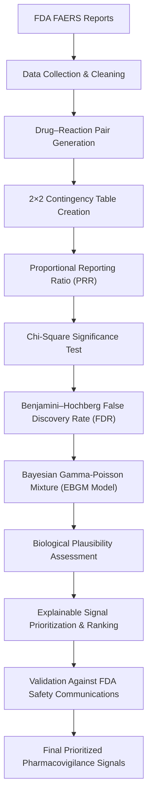

# A Bayesian Pharmacovigilance Pipeline for GLP-1 Drug Safety Signal Detection

**Bayesian Statistics • Pharmacovigilance • Computational Biology • Explainable AI • FAERS • Drug Safety**

---

## Overview

Pharmacovigilance aims to identify previously unrecognized adverse drug reactions using post-marketing safety reports. Traditional disproportionality methods such as the **Proportional Reporting Ratio (PRR)** provide a rapid first-pass screen but are prone to unstable estimates for rare events and inflated false positives when thousands of statistical tests are performed simultaneously.

This project presents an **end-to-end explainable Bayesian pharmacovigilance framework** for mining FDA Adverse Event Reporting System (FAERS) data using five GLP-1 receptor agonists:

- Semaglutide
- Tirzepatide
- Liraglutide
- Dulaglutide
- Exenatide

Rather than stopping at statistical signal detection, the pipeline combines **multiple hypothesis correction, Bayesian shrinkage, biological interpretation, explainable prioritization, and validation against known FDA safety communications** to produce a transparent and reproducible workflow for pharmacovigilance signal triage.

The objective is **not** to determine whether a drug truly causes an adverse event — FAERS cannot establish causality — but to demonstrate a realistic computational workflow capable of identifying statistically robust safety signals worthy of further clinical investigation.

---

## Highlights

- **Full statistical progression, not a single metric.** Implements PRR, chi-square significance testing with Benjamini–Hochberg FDR correction, and a properly fitted two-component Gamma-Poisson mixture model (EBGM) — the same class of Bayesian method used internally by the FDA's own MGPS system — rather than stopping at a single naive disproportionality score.
- **Cross-validated signal detection.** Frequentist (chi-square + FDR) and Bayesian (EBGM) screens are run as independent layers and cross-compared, so surfaced signals aren't dependent on a single statistical assumption.
- **Biology-grounded, not just statistics.** Every candidate signal is annotated with its drug's confirmed mechanism of action, pulled directly from the ChEMBL API, and scored against a four-tier biological plausibility framework — connecting *what's statistically significant* to *what's mechanistically expected*.
- **Fully explainable ranking.** The final triage score is a transparent, hand-specified composite of statistical strength, evidence volume, and biological plausibility — every ranked signal can be decomposed into exactly why it ranks where it does, with no black-box model in the loop.
- **Validated against ground truth.** Surfaced signals were checked against real FDA safety communications for this drug class, successfully rediscovering several known concerns — including a counterintuitive, honestly reported finding that classical pancreatitis doesn't clear the EBGM threshold, and an explanation of exactly why.

---

## Workflow

---

# Key Features

- End-to-end computational pharmacovigilance pipeline built on real-world FAERS data
- Classical disproportionality analysis using PRR and Chi-square statistics
- Benjamini–Hochberg False Discovery Rate correction to reduce false discoveries
- Bayesian signal detection using a two-component Gamma-Poisson mixture model (EBGM)
- Explainable biological plausibility assessment for signal interpretation, cross-referenced against ChEMBL mechanism-of-action data
- Transparent signal prioritization using statistical and biological evidence, fully decomposable into its component parts
- Cross-validation between independent frequentist and Bayesian screens to check signal robustness
- External validation against known FDA GLP-1 safety communications
- Publication-style visualizations demonstrating statistical behaviour and model performance

---

# Why GLP-1 Receptor Agonists?

GLP-1 receptor agonists (Ozempic®, Wegovy®, Mounjaro®, Rybelsus®, Trulicity®, Byetta® and related therapies) have experienced one of the fastest global increases in clinical use for both type 2 diabetes and obesity management.

Their rapid adoption has generated a large and continuously evolving body of post-marketing safety reports, making this drug class an excellent case study for modern pharmacovigilance methodologies.

---

# Methodology

## 1. Data Collection

FAERS reports were retrieved through the **openFDA API** for five GLP-1 receptor agonists together with their major brand names.

To maintain reproducibility and reasonable computational requirements, each drug was limited to **2,000 reports**, resulting in approximately **10,000 raw reports**.

Each report was expanded into individual drug–reaction pairs because a single safety report frequently contains multiple reported adverse events.

After cleaning duplicated terminology, standardizing reaction names, and removing administrative reporting artefacts (e.g., *Drug Ineffective*, *Off Label Use*, *Product Tampering*), the final dataset contained over **42,000 clean drug–reaction observations**.

---

## 2. Statistical Signal Detection

A 2×2 contingency table was constructed for every drug–reaction pair.

The statistical pipeline consisted of four sequential stages.

### Minimum Case Threshold

Pairs reported fewer than three times were excluded to reduce instability from extremely rare observations.

### Proportional Reporting Ratio (PRR)

PRR was calculated as the initial disproportionality metric.

This stage highlighted one of PRR's known limitations: reactions reported for only a single drug often produce extremely large or infinite ratios despite limited evidence.

### Chi-Square Test + False Discovery Rate

Each association was evaluated using a Chi-square test.

Because thousands of hypotheses were tested simultaneously, **Benjamini–Hochberg False Discovery Rate correction** was applied to control false discoveries.

The correction reduced statistically significant candidate signals from approximately **1,002** to **922**, removing associations likely attributable to multiple-testing noise.

### Bayesian Signal Detection (EBGM)

To overcome the instability of PRR, the project implements a **two-component Gamma-Poisson mixture model** fitted by maximum likelihood estimation.

Posterior probabilities are estimated for every drug–reaction pair and used to compute the **Empirical Bayes Geometric Mean (EBGM)**.

Unlike PRR, EBGM shrinks unstable estimates toward the overall reporting distribution while preserving strong evidence supported by sufficient observations.

Candidate safety signals were defined using the conventional pharmacovigilance threshold:

> **EBGM ≥ 2**

The frequentist (chi-square + FDR) and Bayesian (EBGM) screens were run as two independent, complementary layers rather than a single pass-through filter, and their outputs were cross-compared (see Key Findings) as a robustness check.

---

## 3. Biological Plausibility Assessment

Each statistically significant signal was interpreted using known GLP-1 pharmacology together with mechanism-of-action data retrieved directly from the ChEMBL API, which confirmed the class's shared target (GLP-1 receptor agonism, with tirzepatide additionally acting on the GIP receptor). Each final signal is annotated with its drug's confirmed ChEMBL mechanism alongside its plausibility tier.

Signals were grouped into four explainable tiers using curated, mechanism-informed MedDRA-term categorization:

| Tier | Interpretation |
|------|----------------|
| Tier 0 | Administrative / reporting artefacts |
| Tier 1 | Expected mechanism-related adverse effects |
| Tier 2 | Biologically plausible secondary effects |
| Tier 3 | Mechanistically unexplained candidate signals |

This additional layer moves beyond purely statistical ranking by distinguishing expected adverse effects from potentially novel safety hypotheses.

---

## 4. Explainable Signal Prioritization

Signals were ranked using a transparent composite score combining:

- Bayesian statistical strength (EBGM)
- Evidence volume (case counts)
- Biological plausibility tier

Unlike black-box ranking systems, every prioritized signal can be decomposed into the individual components contributing to its final score.

---

## 5. External Validation

To evaluate the credibility of the pipeline, detected signals were compared against reactions appearing in existing FDA safety communications for GLP-1 receptor agonists, including:

- Pancreatitis
- Thyroid-related events
- Gallbladder disease
- Acute kidney injury
- Aspiration
- Suicidal ideation

Rediscovery of known safety concerns provides an external sanity check while demonstrating that the framework successfully identifies clinically relevant signals.

---

# Results

The pipeline progressively refined the candidate signal set through increasingly rigorous statistical filtering.

| Stage | Drug–Reaction Pairs |
|-----------------------------|----------------:|
| Observed pairs | 6,677 |
| Minimum case threshold (≥3) | 2,626 |
| Significant after chi-square + FDR | 922 |
| Final EBGM candidate signals (EBGM ≥ 2) | 807 |

## Key Findings

- Bayesian shrinkage substantially stabilized PRR estimates for low-frequency events, resolving the infinite/inflated values raw PRR produced on small-sample pairs.
- Multiple-testing correction removed approximately **8%** of initially significant associations, indicating a meaningful share of naive candidate signals were likely false discoveries.
- Several established FDA safety signals were successfully rediscovered, validating the pipeline against known ground truth.
- **Classical acute pancreatitis — the single most publicized GLP-1 safety concern — did not clear the EBGM ≥ 2 threshold**, despite 28–64 raw cases per drug. This is because pancreatitis is reported broadly across many unrelated drugs in FAERS, making its *disproportionality* — not its raw frequency — comparatively modest. This result illustrates a key property of disproportionality analysis: it measures relative reporting concentration, not clinical severity or public awareness, and well-known risks can score lower than rarer, drug-specific ones as a result.
- The notebook includes publication-style visualizations illustrating PRR behaviour, Bayesian shrinkage, statistical significance, and validated safety signals.

---

# Tech Stack

| Category | Tools |
|-----------|-------|
| **Programming Language** | Python |
| **Data Processing** | pandas, NumPy |
| **Statistical Analysis** | SciPy, statsmodels |
| **Visualization** | Matplotlib |
| **Biomedical Data Sources** | openFDA FAERS API, ChEMBL API |

---

# Limitations

Although the framework demonstrates a realistic pharmacovigilance workflow, several limitations remain.

- FAERS is a spontaneous reporting database and cannot establish causality.
- Reports are subject to under-reporting, duplicate submissions, and reporting bias.
- The analysis uses a reproducible report cap (2,000 reports/drug) rather than the complete FAERS database.
- Biological plausibility assessment is based on curated, mechanism-informed categorization rather than fully automated pathway mapping. ChEMBL mechanism data was retrieved and directly annotated onto each signal, but is not yet used to automatically classify individual reaction terms.
- ChEMBL mechanism coverage was incomplete for this drug class (2 of 5 compounds had no annotated mechanism record), which would limit any future automated mapping regardless of method.
- Multi-drug reports cannot definitively attribute a reaction to a single medication.

---

# Future Work

Potential extensions include:

- Scaling the framework to the complete FAERS database
- Real-time temporal signal monitoring
- Automated pathway-level biological interpretation (e.g., via Reactome/KEGG pathway data linked to confirmed ChEMBL targets)
- Graph-based drug–reaction network analysis
- Extension to additional therapeutic drug classes
- Integration with literature mining for automated evidence retrieval

---

# Disclaimer

This project uses publicly available FDA FAERS data accessed through the openFDA API together with mechanism-of-action information from ChEMBL.

It is an independent computational pharmacovigilance project created for research, educational, and portfolio purposes and should **not** be interpreted as a clinical or regulatory safety assessment.
